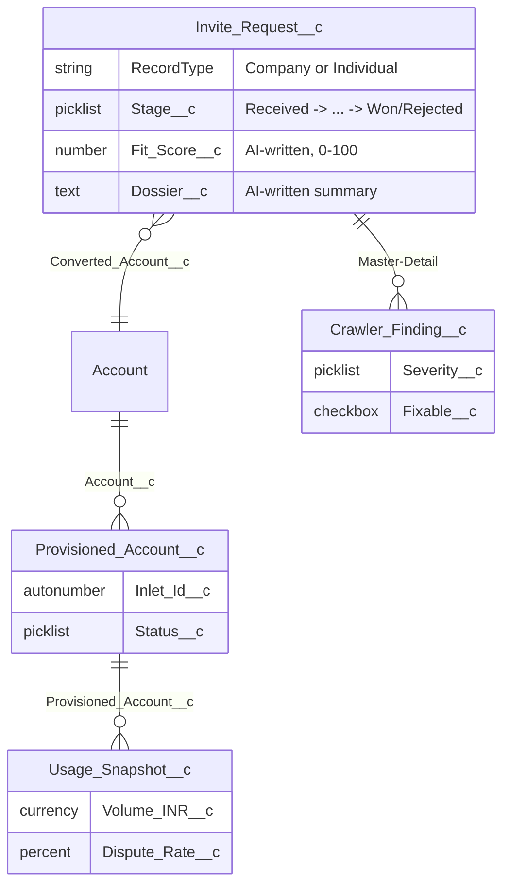

# Invite Only Portal

A hands-on learning project: an invite-only onboarding back office modeled on Stripe India's
real application flow. A person applies → an AI + web-crawler researches and scores them → a
reviewer decides → approved businesses are onboarded/provisioned/supported → the invited cohort's
health is tracked over time (cancel vs upsell).

Built to learn Salesforce's AI stack (Prompt Builder, Flow, Agentforce, Data Cloud) end to end,
plus a full React front end — and to document the journey as a public learning site and a
resume-ready case study.

**[stripe.imswarnil.com](https://stripe.imswarnil.com)** — project overview · **[/learn](https://stripe.imswarnil.com/learn)** — the build log, phase by phase · **[/app](https://stripe.imswarnil.com/app)** — a live demo of the reviewer dashboard

**The mental model:** Salesforce AI reasons over data it is _given_; it does not fetch the web.
n8n fetches (scrapes) → hands clean text to Salesforce → Prompt Builder / Agentforce reason and
write results back. **Brain vs hands.**

## Tech stack

| Layer                          | Tech                                                     |
| ------------------------------ | -------------------------------------------------------- |
| Public front end               | React 19, Vite, TypeScript, React Router                 |
| In-org UI                      | Salesforce Lightning (SLDS), page layouts, Dynamic Forms |
| Automation                     | Flow (screen + record-triggered), Quick Actions          |
| AI (planned/in progress)       | Prompt Builder, Agentforce, Data Cloud                   |
| Crawling (planned/in progress) | n8n                                                      |
| Public intake                  | Experience Cloud (LWR site) + Guest User + Flow          |
| Docs site                      | MDX (`/learn`), frontmatter-driven TOC + pagination      |
| Hosting/CI                     | GitHub Pages, GitHub Actions                             |

## Data model



`Invite_Request__c` has two **record types** — `Company` and `Individual` — each with its own
page layout (Company sees a registration-number field, Individual sees a PAN field; same object,
different layout, driven by which record type is assigned). That layout-per-record-type mapping
lives on the **Profile** (`layoutAssignments`), not the record type itself — miss it, and Salesforce
silently falls back to a minimal default layout even though the real one exists. See
[`/learn`](https://stripe.imswarnil.com/learn) for the write-up of the day that bit us.

## Structure

- `force-app/` — Salesforce metadata for this app only (plain names, no prefix), scoped via
  `manifest/package.xml` — see [`instruction.md`](./instruction.md) §16. This org hosts other
  POCs; never retrieve with wildcards.
- `web/` — React 19 + Vite app: the public homepage (`/`), the reviewer dashboard demo (`/app`),
  and the `/learn` learning site. Deployed to GitHub Pages.
- `learning/` — markdown lessons behind `/learn`, one per phase, with frontmatter-driven
  section grouping, a sidebar TOC, and prev/next pagination.
- `case-study/` — resume-ready writeup + a dated running log of problems solved as they happened.
- `docs/media/` — screenshots/gifs referenced by lessons and the case study.
- `integration/` — n8n workflow exports and Prompt Builder template text.
- `scripts/` — seed/deploy/retrieve helper scripts.

Full build plan, phase by phase: [`instruction.md`](./instruction.md).

**The public intake form** (applying for an invite) is a Salesforce Experience Cloud (LWR) site
with a Guest User profile and a multi-step Flow — not a React route — specifically to learn
Salesforce's own public-site tooling as part of this project's "learn the platform" goal.

## Setup

See `instruction.md` §2 and §4 (Phase 0) for the full tool list and bootstrap commands. Quick
reference:

```bash
sf org login web --alias iop-dev --set-default
sf org display --target-org iop-dev
cd web && pnpm install && pnpm dev
```

## Deploy

- The React app builds and publishes to GitHub Pages via `.github/workflows/pages.yml`, served at
  **stripe.imswarnil.com**.
- Salesforce metadata deploys manually for now (`sf project deploy start --source-dir force-app`)
  — no CI pipeline for the org side yet.

---

_Independent educational project. Not affiliated with, endorsed by, or connected to Stripe. Uses
public information about Stripe India's invite-only program to make the scenario realistic.
Hosted for learning; the public intake form is a styled demo, not Stripe's real form._
