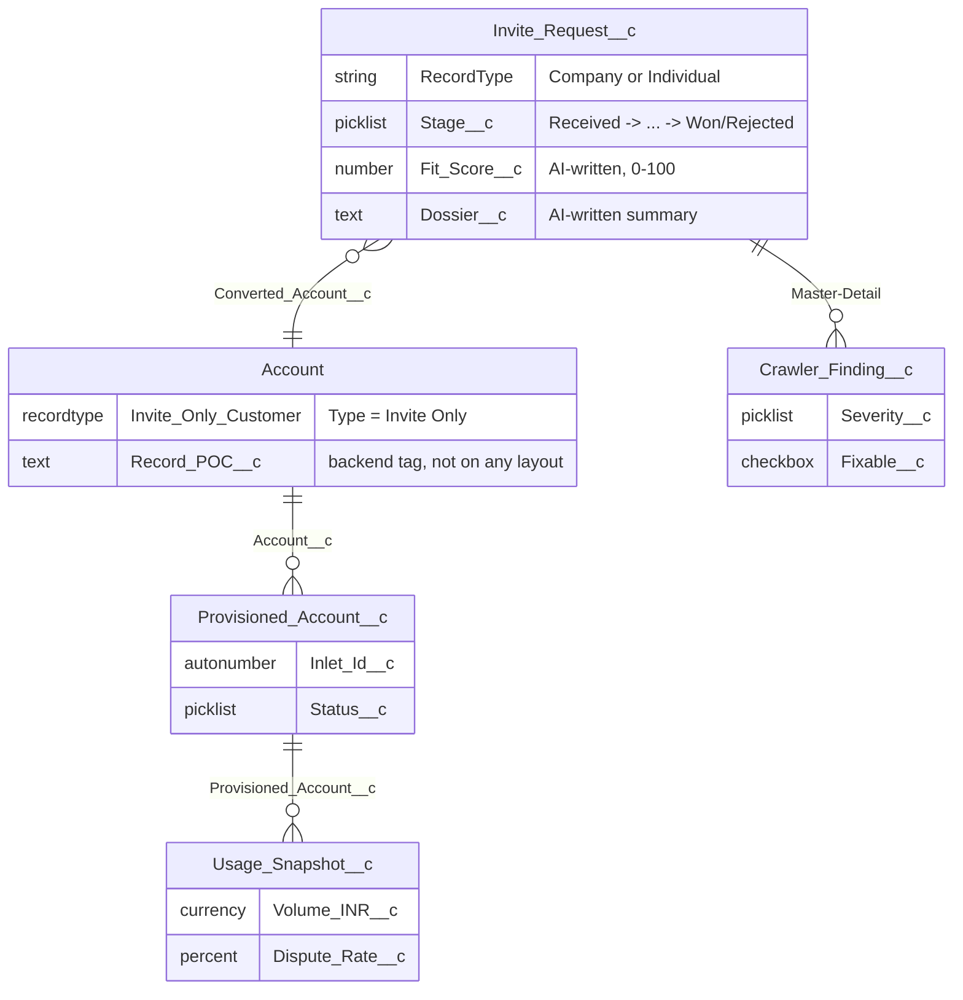
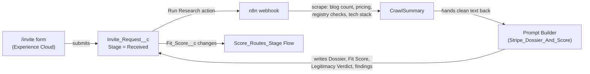

# Invite Only Portal

A hands-on learning project: an invite-only onboarding back office modeled on Stripe India's
real application flow. A person applies → an AI + web-crawler researches and scores them → a
reviewer decides → approved businesses are onboarded/provisioned/supported → the invited cohort's
health is tracked over time (cancel vs upsell).

Built to learn Salesforce's AI stack (Prompt Builder, Flow, Agentforce, Data Cloud) end to end —
and to document the journey as a public learning site and a resume-ready case study.

**[stripe.imswarnil.com](https://stripe.imswarnil.com)** — project overview · **[/learn](https://stripe.imswarnil.com/learn)** — the build log, phase by phase · **[/invite](https://stripe.imswarnil.com/invite)** — where to actually apply (a Salesforce Experience Cloud site, not this static site)

**The mental model:** Salesforce AI reasons over data it is _given_; it does not fetch the web.
n8n fetches (scrapes) → hands clean text to Salesforce → Prompt Builder / Agentforce reason and
write results back. **Brain vs hands.**

## Tech stack

| Layer                    | Tech                                                                                                               |
| ------------------------ | ------------------------------------------------------------------------------------------------------------------ |
| Public site              | Jekyll (Ruby), GitHub Pages — homepage, `/learn`, `/invite` redirect                                               |
| Public intake form       | Salesforce Experience Cloud (LWR site) + Guest User + a 4-step Flow                                                |
| Reviewer UI              | Native Lightning Web Components — a full-width homepage, record editor, sidebar widgets, all Stripe-palette styled |
| Data layer               | 4 custom objects + an `Account` record type, Field History Tracking on the fields that matter                      |
| Automation               | Record-triggered Flow (stage routing, Account provisioning on approval)                                            |
| Server-side logic        | One Apex class (`InviteHomeController`) for the aggregate queries LWC wire adapters can't do alone                 |
| AI (planned/in progress) | Prompt Builder, Agentforce, Data Cloud — see [`agentforce.md`](./agentforce.md)                                    |
| Crawling (planned)       | n8n — see [Integration architecture](#integration-architecture) below                                              |
| Docs site                | Markdown collection, frontmatter-driven TOC + pagination via Liquid                                                |
| Hosting/CI               | GitHub Pages, GitHub Actions                                                                                       |

## Data model



`Invite_Request__c` has two **record types** — `Company` and `Individual` — each with its own
page layout (Company sees a registration-number field, Individual sees a PAN field; same object,
different layout, driven by which record type is assigned). That layout-per-record-type mapping
lives on the **Profile** (`layoutAssignments`), not the record type itself — miss it, and Salesforce
silently falls back to a minimal default layout even though the real one exists. See
[`/learn`](https://stripe.imswarnil.com/learn) for the write-up of the day that bit us.

`Account` reuses the standard object rather than a new custom one, since a provisioned customer
_is_ an Account in every other sense (Opportunities, Contacts, the standard sales model all still
apply). But this org hosts other unrelated POCs that also touch Account — so provisioned Accounts
get their own **record type** (`Invite_Only_Customer`, defaulting `Type` to `Invite Only`) and a
hidden **`Record_POC__c`** tag, so this app's data stays identifiable and filterable without
colliding with anyone else's.

## Automation

Two record-triggered Flows do the work `instruction.md`'s Phase 4 specs, built as Flow rather than
an Apex trigger — that's both what the plan called for and current Salesforce guidance for
standard record automation:

- **`Score_Routes_Stage`** — `Fit_Score__c >= 75` routes to `In Review`, `< 45` routes to
  `Waitlisted`. Ready now; won't fire meaningfully until Phase 3's Prompt Builder actually writes
  a score, but testable by hand-editing the field today.
- **`Fixable_Finding_Routes_Stage`** — a Crawler Finding marked `Fixable` + `Open` moves its
  _parent_ Invite Request to `Action Needed` automatically.
- **`Provision_On_Approval`** — `Decision__c = Approved` creates the `Account` (tagged as above),
  links it back via `Converted_Account__c`, and moves `Stage__c` to `Onboarding`. One click on the
  reviewer's Decision Bar is the entire "approve and provision" path.

## Integration architecture (n8n)

n8n is the **only** thing in this project that fetches the open web — Salesforce AI reasons over
data it's given, it never crawls on its own. The planned flow (Phase 7, not yet built):



A **Demo Mode** flag is planned before any live crawling gets wired up, so the whole app can be
demoed against ~12 seeded sample records with zero paid calls or live scraping.

## Structure

- `force-app/` — Salesforce metadata for this app only (plain names, no prefix), scoped via
  `manifest/package.xml` — see [`instruction.md`](./instruction.md) §16. This org hosts other
  POCs (Coral Cloud, etc.); never retrieve with wildcards.
- `site/` — the public Jekyll site (homepage, `/learn`, `/invite` redirect page). Deployed to
  GitHub Pages via `.github/workflows/pages.yml`.
- `learning/` — markdown lessons, the single source of truth copied into `site/_learning/` at
  build time. Frontmatter-driven section grouping, sidebar TOC, and prev/next pagination.
- `case-study/` — resume-ready writeup + a dated running log of problems solved as they happened.
- `docs/media/` — screenshots/gifs referenced by lessons and the case study.
- `integration/` — n8n workflow exports and Prompt Builder template text, once built.
- `scripts/apex/` — Apex one-offs, including `seed-demo.apex` (demo Invite Requests from India,
  two of which "succeed" end-to-end through `Provision_On_Approval`).

Full build plan, phase by phase: [`instruction.md`](./instruction.md). Salesforce AI plan
(Prompt Builder + Agentforce, concepts and setup steps): [`agentforce.md`](./agentforce.md).

**The public intake form** (applying for an invite) is a Salesforce Experience Cloud (LWR) site
with a Guest User profile and a multi-step Flow — not a page on the Jekyll site — specifically to
learn Salesforce's own public-site tooling as part of this project's "learn the platform" goal.
The reviewer's own screen is native Lightning Web Components, not any external app.

## Setup

See `instruction.md` §2 and §4 (Phase 0) for the full Salesforce tool list and bootstrap commands.
For the public site:

```bash
cd site
bundle install
cp ../learning/*.md _learning/   # sync lessons (CI does this automatically)
bundle exec jekyll serve         # http://localhost:4000
```

## Deploy

- The Jekyll site builds and publishes to GitHub Pages via `.github/workflows/pages.yml`, served
  at **stripe.imswarnil.com**.
- Salesforce metadata deploys manually for now (`sf project deploy start --source-dir force-app`)
  — no CI pipeline for the org side yet.

---

_Independent educational project. Not affiliated with, endorsed by, or connected to Stripe. Uses
public information about Stripe India's invite-only program to make the scenario realistic.
Hosted for learning; the applicant form is a styled demo, not Stripe's real form._
