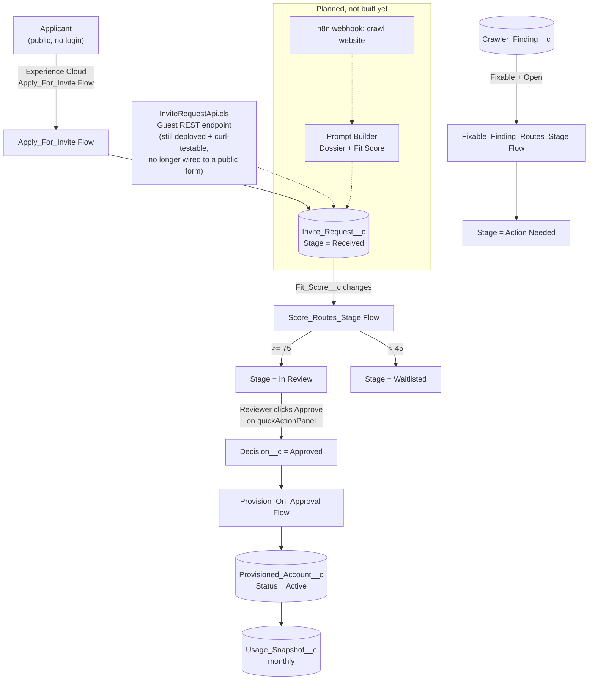

# Validation & Walkthrough Guide

This is a manual test script for the whole system: what's actually built, how the pieces
connect, and exactly how to click/query your way through it to prove each part works. Where
something is designed but not yet built (n8n, the AI scoring layer), that's called out explicitly
so you don't go looking for something that isn't there yet.

Related docs: [`to-do.md`](./to-do.md) (build checklist + outstanding manual Setup steps),
[`README.md`](./README.md) (tech stack, data model), [`agentforce.md`](./agentforce.md) (planned
Prompt Builder/Agentforce concepts), [`instruction.md`](./instruction.md) (the original phase-by-
phase spec this was built from).

## 1. The shape of the system



Four custom objects carry the whole pipeline — no standard Account/Contact/Lead anywhere in it:

| Object | Created by | Represents |
| --- | --- | --- |
| `Invite_Request__c` | Experience Cloud Flow submission (or a direct REST call) | One applicant, Company or Individual record type |
| `Crawler_Finding__c` | (Planned) n8n crawl results | One issue/observation found about an applicant's website |
| `Provisioned_Account__c` | `Provision_On_Approval` Flow, automatically | One live, onboarded Stripe-style account |
| `Usage_Snapshot__c` | Manual/seeded today, (planned) monthly job later | One month of volume/revenue/dispute data for a Provisioned Account |

## 2. How anyone can submit an invite request (no login)

### The live entry point — the native Salesforce Experience Cloud site

`https://go-to-market-ai-dev-ed.develop.my.site.com/invite/` is a Guest User
(`invite Profile`) filling out a **4-step Screen Flow** (`Apply_For_Invite`) that inserts
`Invite_Request__c` with `Stage__c = 'Received'`. This exists to learn Salesforce's own
public-site form tooling as part of the project, and it's what the public Jekyll site's nav
actually links to.

### The Guest REST endpoint — still deployed, no longer wired to a public form

The public Jekyll site (`stripe.imswarnil.com`) used to also carry its own multi-field `/invite`
form, whose JS did a plain `fetch()` POST, no auth token, straight to:
`https://go-to-market-ai-dev-ed.develop.my.site.com/invitevforcesite/services/apexrest/inviteRequest`.
That page has since been removed — the Jekyll site is a documentation/portfolio site now, not a
live intake channel — but the endpoint behind it, `InviteRequestApi.cls`, is still deployed and
behaves exactly as before. It's a `@RestResource` Apex class running as the same Guest User. It
validates required fields, resolves the Company/Individual `RecordTypeId` from the picklist value
you sent (no SOQL — reads `Schema.RecordTypeInfo` directly, since Guest never got read access to
the `RecordType` object itself), and inserts `Invite_Request__c` with `Stage__c = 'Received'`,
`Sub_Status__c = 'New Submission'`. The response is `HTTP 201` with just the new record's **Id** —
never its Name. This is deliberate: Salesforce's "Secure Guest User Record Access" means a Guest
User can never read back a record it just inserted, no matter what object permissions say. The
endpoint doesn't even try.

**To validate this yourself right now**, without touching the browser:

```bash
curl -s -X POST \
  "https://go-to-market-ai-dev-ed.develop.my.site.com/invitevforcesite/services/apexrest/inviteRequest" \
  -H "Content-Type: application/json" \
  -d '{"applicantType":"Individual","firstName":"Doc","lastName":"Validator","workEmail":"docvalidator@example.in","country":"India","state":"Karnataka","city":"Bengaluru","sells":"Services"}' \
  -w "\nHTTP %{http_code}\n"
```

You should get `{"success":true,"recordName":"a06...","errorMessage":null}` and `HTTP 201`. Then,
as an admin in Salesforce, query it:

```sql
SELECT Name, Stage__c, Sub_Status__c, CreatedDate FROM Invite_Request__c
WHERE Work_Email__c = 'docvalidator@example.in'
```

You should see one row, `Stage__c = 'Received'`. Delete it when you're done poking at it —
it's not real applicant data.

### A load-bearing detail worth knowing about (and testing)

The Guest Profile's `recordTypeVisibilities` had to explicitly list both `Invite_Request__c.Company`
and `.Individual` as visible — without that, every guest submission failed with
`INVALID_CROSS_REFERENCE_KEY` on the RecordTypeId, because record-type visibility for Guest Users
is controlled by a totally separate mechanism than the `RecordType` object's own (nonexistent, in
this org) object permissions. If you ever add a third record type to `Invite_Request__c`, you
must add its `recordTypeVisibilities` entry to `invite Profile.profile-meta.xml` or every
submission of that type will fail the same way.

## 3. How it's routed to a human, and what "routed" actually means here

**Important, and worth being upfront about:** there is **no Queue and no Approval Process**
in this build. `Decision__c` is a plain picklist a human sets by hand (via the `quickActionPanel`
widget); there's no automated re-assignment to a review queue. The record's **Owner** after a
Guest submission is the Guest User itself, not any human — so reviewers find new submissions via
the **All Invite Requests** list view (Setup → the tab's list view picker), not "My" filters.
That's a deliberate simplification for this build, not an oversight — `instruction.md`'s original
spec called for a `Review_Queue`, but it was never built.

What **is** automated is stage progression once data changes:

- **`Score_Routes_Stage`** (record-triggered Flow on `Invite_Request__c`, fires on
  `Fit_Score__c` change): `>= 75` → `Stage__c = 'In Review'`. `< 45` → `Stage__c = 'Waitlisted'`.
  Nothing happens in between — the record just sits wherever it was.
- **`Fixable_Finding_Routes_Stage`** (record-triggered Flow on `Crawler_Finding__c`, fires on
  create/update where `Fixable__c = true` and `Status__c = 'Open'`): sets the **parent**
  `Invite_Request__c.Stage__c = 'Action Needed'`, `Sub_Status__c = 'Fix Requested'`.

**To validate:** pick any `Invite_Request__c` record and manually edit `Fit_Score__c` to `80`
(a manager/reviewer can do this directly, or through Apex/Setup). Watch `Stage__c` flip to
`In Review` on save, with no other action taken. Set it to `30` instead and watch it go to
`Waitlisted`. This is the exact mechanism that's meant to be driven by the (not yet built)
n8n → Prompt Builder scoring step — see §6.

## 4. How a reviewer starts working a request

Open any `Invite_Request__c` record. The record page (`Invite_Request_Record_Page1`, or its twin
`Invite_Request_Record_Page` — both kept identical on purpose, see §8) gives you, top to bottom:

1. **`stageProgressBar`** at the very top of the header (it's the *only* header item now —
   `force:highlightsPanel` was removed on purpose to make room for the workspace below) — a
   Received→Won stepper. If the record is `Waitlisted` or `Rejected` it shows a distinct off-ramp
   banner instead of forcing those into the linear steps.
2. **`inviteRequestWorkspace`** fills the main region, and is the *entire* rest of the page — the
   FlexiPage's own sidebar region carries nothing but the standard Activity/Chatter tab now, so
   this one component owns the full width instead of sharing it with Salesforce's separate sidebar
   column. Two parts:
   - **A main column + a narrow (320px) sidebar-styled column beside it** (1 column on narrow
     screens, sidebar reordered to the top). The main column is `inviteRequestEditor`: every
     editable/read-only field on the object, grouped into 5 tabs (Contact, Business, Research &
     Scoring [read-only, AI-written], Pipeline, Notes) in a **vertical rail down the left** —
     icon + label stacked, not a row across the top — with the active tab's content filling the
     rest of the width beside it. All 5 tab panels stay mounted in the DOM; only CSS
     (`display: none`) hides the inactive ones, specifically so switching tabs never drops unsaved
     edits from a tab you're not currently looking at. **Save** is pinned at the top of that left
     rail, always visible regardless of scroll position or active tab. The narrow side column
     stacks `quickActionPanel` (Approve/Waitlist/Reject as icon-in-a-box tiles — green check /
     amber warning / red close, current decision highlighted; this is the only place `Decision__c`
     should be set from, and approving here is what fires `Provision_On_Approval`, §5) above
     `inviteTimeline` (Field History Tracking on `Stage__c`/`Sub_Status__c`/`Decision__c`/
     `Fit_Score__c`/`Legitimacy_Verdict__c` — this was broken until recently, see §9).
   - **A full-width row below that**, holding `scoreGauge` (`Fit_Score__c` as a ring gauge, same
     45/75 thresholds `Score_Routes_Stage` uses), `legitimacyBadge`, `daysInStageTile` (stage age,
     turns red at 5+ days), `relatedProvisionedAccountCard` (empty/"not provisioned yet" until
     approval, then the linked account's status/plan/risk/contract value, linked straight to it),
     `complianceChecklist` (Company only — Registration/PAN/GST/CIN/IEC presence), and
     `findingsList` (related `Crawler_Finding__c` rows, with a "Flag to Applicant" action on
     open+fixable ones).
3. Standard Related Lists container directly below the workspace (no more Detail/Related tab
   split — the editor above already covers every field the old Detail tab showed).

**To validate the whole reviewer loop end to end:** open an `Invite_Request__c` in `In Review`
with `Decision__c = Pending`, click **Approve** on the `quickActionPanel` tile, and watch (a)
`Stage__c` becomes `Onboarding`, (b) a new `Provisioned_Account__c` appears in
`relatedProvisionedAccountCard` within a few seconds, (c) a new row appears in `inviteTimeline`
in the sidebar column. If nothing's currently sitting in `In Review`/`Pending` (data drifts as people
click around — check with the SOQL below), approve any `Pending` record instead; the same thing
happens regardless of stage.

```sql
SELECT Name, Stage__c, Decision__c, Fit_Score__c FROM Invite_Request__c
WHERE Stage__c = 'In Review' AND Decision__c = 'Pending'
```

## 5. What happens on approval — `Provision_On_Approval`

Record-triggered Flow on `Invite_Request__c`, fires when `Decision__c` **changes to**
`'Approved'` (an `ISCHANGED()` guard, so re-saving an already-approved record doesn't refire it):

1. Creates one `Provisioned_Account__c`: `Invite_Request__c` = the triggering record's Id,
   `Status__c = 'Active'`, `Products_Live__c = 'Payments'` (a starting default — Plan Tier, Risk
   Level, Contract Value, Go Live/Renewal dates are **not** set by this Flow; a CSM fills those in
   by hand afterward, which is also what `renewalCountdown`/`productsLiveChecklist` are there to
   surface once populated).
2. Updates the `Invite_Request__c` itself: `Stage__c = 'Onboarding'`.

No standard `Account` object is touched anywhere in this — an earlier version of this build did
create a standard Account here; it was fully removed (see `to-do.md` §"Data model" for the
before/after and the one manual cleanup step still pending on the now-unused
`Account.Invite_Only_Customer` record type).

**To validate the automation is real (not just seeded data):** take any already-`Approved`
record and toggle `Decision__c` away and back:

```apex
Invite_Request__c r = [SELECT Id FROM Invite_Request__c WHERE Decision__c = 'Approved' LIMIT 1];
r.Decision__c = 'Pending'; update r;
r.Decision__c = 'Approved'; update r;
```

Then query for a fresh `Provisioned_Account__c` pointing back at it. This is exactly how the
current demo accounts (`PA-0004` through `PA-0008`) were proven to come from the real Flow, not a
hand-inserted row standing in for it.

## 6. Where n8n and AI scoring fit — **mostly planned, one piece now built**

Most of this part of the architecture still exists only as a design, not as deployed metadata.
Be careful not to go looking for a working "Run Research" button — there isn't one yet (no quick
action, no n8n webhook).

**One real exception:** `Invite_Only_Brief` — a deployed, source-controlled `GenAiPromptTemplate`
(`force-app/main/default/genAiPromptTemplates/`) that grounds on one `Invite_Request__c` record
and writes a short approve/waitlist/reject-oriented brief, using only what the applicant put on
the form (not the AI-derived fields below — see `agentforce.md` §2a for why). It's deployed in
`Draft` status and isn't called from any button/Flow/LWC yet — open it in Setup → Prompt Builder →
**Try It** to see it generate against a real record. That's a genuinely different, smaller thing
than the `Dossier_And_Score` template described below, which remains conceptual.

**The intended flow for the scoring/research side**, once built (`instruction.md` Phase 7):

1. A reviewer (or an automatic trigger on `Stage__c = 'Received'`) fires a "Run Research" action.
2. That action calls an **n8n webhook**. n8n is the *only* thing in this design that ever touches
   the open web — it scrapes the applicant's website/registry data (blog count, pricing page,
   tech stack, entity registration) and hands back clean structured text. Salesforce's AI never
   crawls anything itself.
3. n8n's output is handed to a **Prompt Builder** template (planned name:
   `Dossier_And_Score` — see `agentforce.md`), which writes back onto the `Invite_Request__c`:
   `Dossier__c` (summary), `Fit_Score__c`, `Legitimacy_Verdict__c`, and creates
   `Crawler_Finding__c` child rows for anything noteworthy.
4. Writing `Fit_Score__c` is what re-enters the system you can already test — it's the same field
   `Score_Routes_Stage` (§3) already watches. **Everything downstream of "a score gets written" is
   built and testable today**; only the "how the score gets written" step (n8n + Prompt Builder)
   is still manual/absent. Until it's built, a human (or a seed script) has to set `Fit_Score__c`
   by hand to exercise the routing.
5. A **Demo Mode** flag is planned so the whole thing can be shown against seeded sample data with
   zero live scraping or paid API calls — also not built yet.

If you want to simulate what n8n *would* eventually do, just hand-set `Fit_Score__c` and
`Legitimacy_Verdict__c` on a `Received`/`AI Validation` record and watch §3's routing fire — that's
the honest current substitute.

## 7. Two people, two very different jobs — validate both

### Persona A — the person who actually provisions invites (Reviewer / CSM)

This person lives on individual `Invite_Request__c` and `Provisioned_Account__c` records, not the
dashboard. Assigned **`Reviewer_PS`** (decide Stage/Sub Status/Decision, read-only on AI fields)
and/or **`CSM_PS`** (edit `Provisioned_Account__c`/`Usage_Snapshot__c`, read-only on the applicant
side — a CSM shouldn't be re-deciding an application, just running the account after it exists).

Validation script:
1. Open the **All Invite Requests** list view (not "Recently Viewed" — remember, they're not the
   Owner). Pick one in `Received` or `AI Validation`.
2. Nudge `Fit_Score__c` up past 75 by hand (standing in for n8n/Prompt Builder) → confirm
   `Stage__c` flips to `In Review` on its own.
3. On the record page, check `complianceChecklist`/`legitimacyBadge`, then **Approve** on the
   `quickActionPanel` tile (right column).
4. Follow the link in `relatedProvisionedAccountCard` to the new `Provisioned_Account__c`.
5. As the CSM persona now: fill in `Plan_Tier__c`, `Contract_Value_INR__c`, `Go_Live_Date__c`,
   `Renewal_Date__c` — watch `renewalCountdown` and `productsLiveChecklist` update.
6. Add a `Usage_Snapshot__c` for the current month, then check `usageTrendSparkline` and
   `monthOverMonthDelta` (the latter needs at least two months of snapshots to show anything but
   "No prior month to compare").

### Persona B — the leader who tracks what's happening across everything

This person almost never opens an individual record. They live on the **homepage**
(`Invite_Only_Home_App_Page`, the default landing tab of the `Invite Only Onboarding` app), which
is a bento grid: a CTA tile, four stat tiles, two Chart.js charts (stage funnel, applicant type
split), `topPerformingAccounts`, `readyToProvisionList`, `recentInvitesList`,
`pipelineAgingList` — all aggregate queries (`InviteHomeController.cls`), nothing scoped to one
record. Assigned **`Admin_PS`** in this build (there's no separate "read-only exec" permission
set — if you want one that's genuinely view-only across all four objects, that's a straightforward
follow-up: clone `Admin_PS`'s object permissions down to Read-only everywhere, no Create/Edit/Delete).

Validation script:
1. Open the homepage. Confirm the stat tiles match a manual count
   (`SELECT COUNT(Id) FROM Invite_Request__c`, etc. — they should agree).
2. Use the CTA's **"+ New invite request"** button — confirm the modal opens, saves, and the
   stat tiles' numbers move without a page reload.
3. Check `pipelineAgingList` — anything in `Action Needed`/`In Review` for 5+ days should show up
   red, oldest first.
4. Check `topPerformingAccounts` — should rank `Provisioned_Account__c` records by summed
   `Usage_Snapshot__c.Volume_INR__c`, highest first, each clickable.
5. Check `readyToProvisionList` — `In Review` + `Decision = Pending`, highest Fit Score first. If
   it's empty, that's real (nothing currently qualifies), not a bug — create one via the SOQL in
   §4 to see it populate.

## 8. How permissions were designed

Nothing here is automatic — every grant below had to be added explicitly. Metadata-API deploys
start every new object/field/tab at **zero** access for every profile and permission set; nothing
is visible until it's granted somewhere.

| Permission Set | Who | Invite_Request__c | Crawler_Finding__c | Provisioned_Account__c | Usage_Snapshot__c |
| --- | --- | --- | --- | --- | --- |
| **`Admin_PS`** | Admin / leader persona | Full CRUD + View/Modify All | Full CRUD + View/Modify All | Full CRUD + View/Modify All | Full CRUD + View/Modify All |
| **`Reviewer_PS`** | Reviewer | Read/Edit (no Create/Delete); AI-written fields (Dossier, Fit Score, verdict, etc.) are **read-only** even here — those are meant to come from Prompt Builder/n8n, not a human typing over them | Read/Edit | *(none)* | *(none)* |
| **`CSM_PS`** | Customer Success | Read-only | Read-only | Create/Read/Edit | Read/Edit |
| **`TSE_PS`** | Support | Read-only | *(none)* | Read/Edit (pause/cancel/rotate keys) | Read-only |

A few design decisions worth knowing if you're validating the *design*, not just the access:

- These are **Permission Sets**, not Profile edits — deliberately. A Profile-only grant gets
  silently wiped the next time anyone retrieves/deploys that profile for an unrelated reason;
  Permission Sets don't have that failure mode, and can be stacked (a user can hold `CSM_PS` and
  `TSE_PS` at once if their job is genuinely both).
- `Admin_PS` additionally carries `EditPublicFilters` ("Manage Public List Views") and
  `CreateCustomizeFilters` — without these, an admin can't even mark a list view as shared beyond
  themselves, which looks exactly like "I can't view all list views" when you first hit it.
- `recordTypeVisibilities` for `Invite_Request__c.Company`/`.Individual` are granted identically
  on every one of the four permission sets — record type visibility is a separate mechanism from
  object/field permissions, and missing it on even one permission set means users with *only* that
  set can't select or see records of that type, independent of every other grant being correct.
- The **Guest User** (`invite Profile`, Guest User License) is intentionally the narrowest: Create-only
  on `Invite_Request__c` (no Read/Edit/Delete), read on `RecordType`, and class access to exactly
  one Apex class (`InviteRequestApi`). Create-implies-Read is a platform rule for Guest Users, but
  Salesforce's mandatory "Secure Guest User Record Access" blocks the read-back regardless — see
  §2's note on why the REST endpoint never re-queries what it just inserted.
- Page **Layout Assignment** (which layout a profile actually sees) is a *different* mechanism
  from FLS/object permissions and is easy to get wrong silently — a field can have perfect FLS and
  still never render if the profile is pointed at the wrong (or no) layout. This bit us twice on
  `Provisioned_Account__c`/`Usage_Snapshot__c` before landing on a minimal, single-purpose
  `layoutAssignments`-only deploy to the `Admin` profile (safe because it's additive and doesn't
  touch anything else on that profile).

## 9. A couple of things that were silently broken and are worth re-checking

If you're validating against a slightly older state of this org, these two were real, confirmed
bugs — re-run their checks if anything above looks off:

- **`inviteTimeline` showing nothing:** the object had `enableHistory = true`, but every
  individual field's `trackHistory` was `false` — Field History Tracking was recording literally
  nothing. Fixed by turning on `trackHistory` for the 5 fields the widget reads. Confirm with:
  `SELECT Field, OldValue, NewValue, CreatedDate FROM Invite_Request__History WHERE ParentId = '<any Id>'`
  — should return at least one row for any record that's changed stage/status/decision/score/verdict
  since the fix.
- **`findingsList` (Crawler Findings sidebar widget) showing nothing:** was calling
  `getRelatedListRecords` with `relatedListId: "Crawler_Findings__r"` (that's SOQL subquery
  syntax, wrong for this wire adapter) and unqualified field names. Fixed to the bare relationship
  name (`"Crawler_Findings"`, no `__r`) and fully-qualified `Object.Field` names. If you ever build
  a similar related-list widget (`usageTrendSparkline` already got this right the first time,
  copying the fixed pattern), copy from there, not from `findingsList`'s git history.

## 10. Quick reference

```sql
-- Everything in the pipeline right now, oldest first
SELECT Name, Applicant_Type__c, Stage__c, Sub_Status__c, Decision__c, Fit_Score__c
FROM Invite_Request__c ORDER BY CreatedDate

-- Every provisioned account and what it came from
SELECT Name, Invite_Request__r.Name, Status__c, Plan_Tier__c, Risk_Level__c
FROM Provisioned_Account__c

-- Usage history for one account
SELECT Month__c, Volume_INR__c, Revenue_INR__c, Dispute_Rate__c
FROM Usage_Snapshot__c WHERE Provisioned_Account__c = '<Id>' ORDER BY Month__c

-- Field history for one request (confirms the timeline fix, see §9)
SELECT Field, OldValue, NewValue, CreatedDate, CreatedBy.Name
FROM Invite_Request__History WHERE ParentId = '<Id>' ORDER BY CreatedDate DESC
```

- Public site: `https://stripe.imswarnil.com` (documentation/portfolio only — no live apply form)
- Native Experience Cloud form (the live entry point): `https://go-to-market-ai-dev-ed.develop.my.site.com/invite/`
- Guest REST endpoint (still deployed, curl-testable, no longer wired to a public form): `https://go-to-market-ai-dev-ed.develop.my.site.com/invitevforcesite/services/apexrest/inviteRequest`
- Apex tests that prove the backend logic: `sf apex run test --class-names InviteHomeControllerTest --class-names InviteRequestApiTest`
